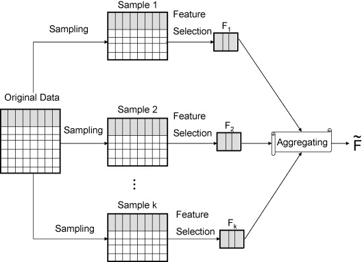

</div>

load the required libraries:

```{r message=FALSE, warning=FALSE}
library(glmnet)
library(c060)
library(ranger)
library(igraph)
```

In biology we often encounter problems that can roughly be called “structure estimation” problems, when our goal is to learn parsimonious and interpretable model from omics datasets. The problem becomes really hard for datasets where the number of observations is smaller than the number of features. To solve this problem we can use LASSO: a widely used regularization technique that performs variable selection via shrinkage. Shrinkage is when regression coefficients betta are shrunk toward zero. The lasso procedure encourages simple, sparse models (i.e. models with fewer parameters). 

</div>
</div>


# Loading and preparing the data

**Our goal** is to model activity of transcription factor WT1 using scRNAseq data. 
The gene expression data is stored in a matrix wich contains gene level expression counts of 2443 genes, measured in 860 individual cells,  this is high-dimensiional omics dataset. Note, that target genes of WT1 are excluded from the expression dataset.
Activity of the transcription factor is stored in a separate vector where every cell is represented by a single value, functional measure of protein activity.

To summarize, we have to deal with the thouthands of features so we are in a very high dimensional setting, plus the number of samples is smaller than the number os features so we have p > n problem.
```{r}

# change you work directory to the workshop directory
# setwd("LASSO_workshop")

# load prefiltered scRNA-seq gene expression data, normalized by library size
LASSOws_geneExprDat <- readRDS("LASSOws_geneExprDat.rda")
# let,s see first 5 rows and columns of the expression data 
LASSOws_geneExprDat[ 1:5 , 1:5 ]

# load measurments for the variable of interest (  activity of a Transcription Factor)
LASSOws_phenotypeDat <- readRDS("LASSOws_phenotypeDat.rda")
# let,s see first elements of the vector
head(LASSOws_phenotypeDat)
```
</div>

We need to split our data into train/test and validation sets. To make our validation task a bit more complicated we will split data according to experimental batches.

```{r}
# log transform expression data 
LASSOws_geneExprDat_tr <- log( LASSOws_geneExprDat + 1) 
# center data
model_data <- scale( cbind ( LASSOws_phenotypeDat , LASSOws_geneExprDat_tr ) , scale = F)

# create a vector for train and test
testrain <- c(rep(0,587), rep(1,273))

# split the data
model_data_train <-  model_data[ which( testrain==0) , ] 

model_data_valid <-  model_data[ which( testrain==1) , ]

# see how data is splited
graphics::pie( c(587 , 273 ), labels = c("train", "validation" ) )

```
</div>


# Problems with using OLS on the full dataset

**OLS** ordinary least squares, is a method for estimating the unknown parameters in a linear regression model. OLS chooses the parameters of a linear function of a set of explanatory variables by the principle of least squares: minimizing the sum of the squares of the differences between the observed dependent variable (values of the variable being predicted) in the given dataset and those predicted by the linear function. ( _Wikipedia_ )

Let`s see what happens if we fit linear regression model usin standard lm() R function. First we fit model using only one gene as predictor. 
 
```{r}
### fit linear model with one gene
lm_onegene <- lm( model_data_train[ , "LASSOws_phenotypeDat"] ~ model_data_train[,"Actb"] )
# check the summary table
summary( lm_onegene )

```

Inspect the summary. We can see that the gene is predictive, otherwise the summary looks fine and contains various interesting statistics, such as significance of the coefficient estimate and R squared - amount of the variation explained.

Now we will try to fit model using using all genes detected in scRNAseq as predictors.

```{r}

### fit linear model with all genes
lm_allGenes <- lm(  model_data_train[ , "LASSOws_phenotypeDat"] ~ model_data_train[, -1 ] )
# check the summary table
head(summary(lm_allGenes)$coefficients) 

```

As we can see, there is no significance values for the estimates of the parameters of our full model! This should not be surprizing because we can't actually estimate parameters of the model with OLS when the number of observations is smaller than the number of features, i.e. p > n .

</div>
</div>


# Regularized regression with cross-validation

When we experience these problems with OLS we need to use regularized regression (also commonly referred to as penalized models or shrinkage methods) to control the parameter estimates. Regularized regression puts constraints on the magnitude of the coefficients and will progressively shrink them towards zero. This constraint helps to reduce the magnitude and fluctuations of the coefficients and will reduce the variance of our model. The objective function of regularized regression methods is very similar to OLS regression; however, we add a penalty parameter so the objective will be _minimize( RSS + P )_.

Penalty is controled by the regularization or tuning parameter λ. However, there is no way we can know lambda apriori so we need to identify the optimal λ value from our data. Probably the most popular solution is to perform cross-validation. 
In the course of cross-validation, the data is repeatedly partitioned into training and validation data. The model is fit to the training data and the validation data is used to calculate the prediction error. This in turn enables us to identify the values of λ and that optimize predictive performance (i.e., minimize the estimated mean-squared prediction error).


To fit regularized regression model and choose best regularization parameter lambda with cross validation we can use cv.glmnet() function from glm R package. To learn more about the package you can check out the package vignette http://web.stanford.edu/~hastie/glmnet/glmnet_alpha.html 
You can also read the following blogpost for detailed explanation of regularized regression: http://uc-r.github.io/regularized_regression

```{r}

### fit lasso with 10-fold cross-validation
lasso.cv <- cv.glmnet( y=model_data_train[ , "LASSOws_phenotypeDat"] , x= model_data_train[,-1] , alpha = 1 , nfolds =10)
###  check what's inside the output
summary(lasso.cv)

### plot cross-validation results
plot(lasso.cv)

# See how increasing lambda shrinks the coefficients --------------------------
# Each line shows coefficients for one variables, for different lambdas.
# The higher the lambda, the more the coefficients are shrinked towards zero.
plot( lasso.cv$glmnet.fit, xvar = "lambda"  )

# Best cross-validated lambda
lambda_cv <- lasso.cv$lambda.min

# select coefficients for the best lambda and inspect them
lasso.cv_coeff <- coef( lasso.cv, s = "lambda.min")
head(sort(lasso.cv_coeff[which(lasso.cv_coeff!=0),1]))
tail(sort(lasso.cv_coeff[which(lasso.cv_coeff!=0),1]))

# plot non-zero coefficients
barplot(sort(lasso.cv_coeff[which(lasso.cv_coeff!=0),1]), horiz = F,  xaxt="n")

```

Out of more than 2400 variables LASSO+cross.validation automatically selected ~120 predictors, just 5% of the parameter space. This indicates that many genes in the dataset are highly interdependent and can't uniquely explain variation in the transcription factor activity. 
</div>
</div>
</div>


# LASSO with stability selection

If we want to narrow down candidate gene set even further and build even smaller and more robust model we can use LASSO with stability selection. The rough idea behind stability selection is to inject more noise into the original problem by generating bootstrap samples of the data, and to use a base structure learning algorithm to find out which features are important in every sampled version of the data.

For a feature to be considered stable (or important), it has to be selected in a high number of perturbed versions of the original problem. This tends to filter out features that are only weakly related to the target variables, because the additional noise introduced by the bootstrapping breaks that weak relationship.



The base algorithm is run on every bootstrap sample for a grid of values of the penalization parameter lambda, and not just a single value. A-priori we don’t know what the right level of regularization for a problem is. If a variable is related to the target variable in a meaningful way, it should show up in most bootstrap samples for at least one value of the penalization parameter.

We will use stability selection and lasso implemented in c060 package. To read more about the package check out manual : https://www.jstatsoft.org/article/view/v062i05
The original paper on stability selection : https://stat.ethz.ch/~nicolai/stability.pdf 

```{r}
# fitting the whole pathby subseting 70% of data in each bootstrap
lpath <- c060::stabpath( y=model_data_train[ , "LASSOws_phenotypeDat"] , x=model_data_train[,-1] , size=0.7, steps=100, mc.cores= 4 , family = "gaussian" )

#  select a stable set of variables.
ssfit <- c060::stabsel( lpath,type="pfer", error=0.1, pi_thr=0.6 )

# plot penalization and stability paths together with some statistics
 par(mar=c(1,1,1,1))
 plot(lpath)

# extract selection probabilities under the optimal lambda
all_predictors <- lpath$x[,ssfit$lpos]
# select predictors chosen in more than 60% of models
stable_predictors <- all_predictors[ all_predictors > 0.6 ] 
# display all stable predictors
stable_predictors

# fit glm with stable predictors found by LASSO with stability selection
XX <- as.data.frame( model_data_train[,c( "LASSOws_phenotypeDat",names(stable_predictors))] )
lasso.stabsel <-  lm( LASSOws_phenotypeDat ~ . ,  data = XX)

```
LASSO with stability selection suggests just a handful of stable predictors for our transcription factor. This model is very parsimonious!
</div>
</div>
</div>

# compare LASSO with other regularized regression models and with Random Forest

We fit Ridge and Random Forest regression  models to compare with LASSO+cross.validation and LASSO+stab.sel. Note that neither Ridge nor Random forest do not perform automatic variable selection.
```{r}
### fit Ridge regularised regression
Ridge.cv <- cv.glmnet(y=model_data_train[ , "LASSOws_phenotypeDat"] , x= model_data_train[,-1] , alpha = 0 , nfolds =10)
# plot regularization path, note that the top axis has a constant value equal to the number of all variables, telling that we don't do variable selection
plot( Ridge.cv )

###  fit Random Forest regression
RFdat <- as.data.frame( model_data_train )
RF.model <- ranger::ranger(  dependent.variable.name = "LASSOws_phenotypeDat" , data=RFdat ,  num.trees = 500 ,  importance="permutation" )
# RF provides a measure of feature importance but do not perform variable selection
head( ranger::importance(RF.model)[order(-importance(RF.model))] , 10)


```

Now make prediction using all trained models and the validation data that we put aside in the beginning. 
```{r}
### predict expression using various models
lasso.stabsel_predict <- predict( lasso.stabsel , newdata = as.data.frame( model_data_valid[,-1] ) )
lasso.cv_predict <- predict( lasso.cv , newx = model_data_valid[,-1] ,s = "lambda.min")
Ridge.cv_predict <- predict( Ridge.cv , newx = model_data_valid[,-1] , s = "lambda.min")
RF_predict <- predict( RF.model , data=model_data_valid[,-1] )


### compute RMSE
lasso.stabsel_rmse <- sqrt( sum( (model_data_valid[,1] - lasso.stabsel_predict)^2) )
lasso.cv_rmse <- sqrt( sum( (model_data_valid[,1] - lasso.cv_predict)^2) )
Ridge.cv_rmse <- sqrt( sum( (model_data_valid[,1] - Ridge.cv_predict)^2) )
RF_rmse <- sqrt( sum( (model_data_valid[,1] - RF_predict$predictions)^2) )

# compare RMSE from different methods
barplot( c(lasso.stabsel_rmse, lasso.cv_rmse , Ridge.cv_rmse , RF_rmse) ,
         ylab = "RMSE" , 
         names.arg =  c("lasso.stabsel", "lasso.cv" , "Ridge.cv" , "RF_rmse"))

```

The model built with LASSO+stability selection will have higher bias (bigger RMSE) than models built with LASSO and Ridge using cross-validation. But it is performing surprisingly well, taking into account that it uses one and two order of magnitude less parameters than cross-validation LASSO and Ridge models, correspondingly. Also, due to the bias-variance trade-off, we can expect the model to have low variance, aka. better generalizibility, on other datasets.
Thus, LASSO+stability selection model improves interpretability and solve issue of collinearity at the expense of slightly increased bias.


# visualizing models

It is often helpful to visualize a model. Let's investigate relations between variables selected by LASSO+stability.selection and visualize them graphically.
```{r}
### estimate partial correlations between stable predictors
lasso.stabsel_Pcor <- ppcor::pcor( model_data[,c("LASSOws_phenotypeDat", names(stable_predictors))] )

### create adjacency matrix using partial correlation estimated
adj <- lasso.stabsel_Pcor$estimate
# select significant partial correlations
adj[which( p.adjust(lasso.stabsel_Pcor$p.value, method = "fdr") <= 0.05 )] <- 1
adj[which( p.adjust(lasso.stabsel_Pcor$p.value, method = "fdr") > 0.05 )] <- 0
diag(adj) <- 0

### make an igraph object from an adjacency matrix
lasso.stabsel_Pcor_graph <- graph_from_adjacency_matrix( adj , mode="undirected" , diag = F)

# add weights to reflect strength of the correlations
weights <- (adj*lasso.stabsel_Pcor$estimate)
weights <- weights[lower.tri(weights)]
weights <- weights[which(weights!=0)]
E(lasso.stabsel_Pcor_graph)$weights <- abs(weights)*10

# add color to reflect direction of the correlations
E(lasso.stabsel_Pcor_graph)$color[ which(weights < 0) ] <- 'blue'
E(lasso.stabsel_Pcor_graph)$color[ which(weights > 0)  ] <- 'red'

# plot the resulting graph
plot( lasso.stabsel_Pcor_graph , vertex.size=8, edge.width=E(lasso.stabsel_Pcor_graph)$weights, vertex.label.cex = 1.4 , edge.arrow.size=0.6 )


```

This graph represents model of transcription factor activity that we've built using LASSO+stability.selection and partial correlations. The node named _LASSOws_phenotypeDat_ represents activity of WT1 transcription factor and other nodes represent genes that are the best predictors of its activity. Thicknes of edges corresond to partial correlation coefficients and color reflects the sign of the correlation. What kind of genes were selected as predictors in our model? Do you think this model make sense?

</div>
</div>


# LASSO on a matrix, graphical LASSO

we can continue structure estimation exercise by modeling every gene in our expression dataset and then recovering a graph where every non-zero coefficient will be represented as an edge between two genes. Note, running the code below will take long time and/or require lots of computational power.
```{r}

# ### 1) model every gene iteratively in the same way we modeled one feature of interest.
# full_lasso.ss_model <- vector( "list" , ncol(model_data))
# for(i in 1:ncol(model_data)) {
#   # fitting the whole pathby subseting 70% of data in each bootstrap
#   lpath <- c060::stabpath( y=model_data [ , i ] , x=model_data[,-i] , size=0.7, steps=100, mc.cores= 4 , family = "gaussian" )
#   #  select a stable set of variables.
#   ssfit <- c060::stabsel( lpath,type="pfer", error=0.1, pi_thr=0.6 )
#   
#   full_lasso.ss_model[[i]] <- all_predictors <- lpath$x[,ssfit$lpos]
# }
# 
# ### 2) do partial correlation with lasso
# library(parcor)
# LASSOws_modelPcor <- parcor::adalasso.net( model_data )
# 
# 
# ### 3) use stability selection fit function for sparse inverse covariance using package QUIC graphical models
# library(QUIC)
# library(stabs)
# glasso <- stabs::stabsel( x=LASSOws_geneExprDat_train , fitfun = quic.graphical_model , cutoff = 0.6, PFER = 1 )

```
</div>

